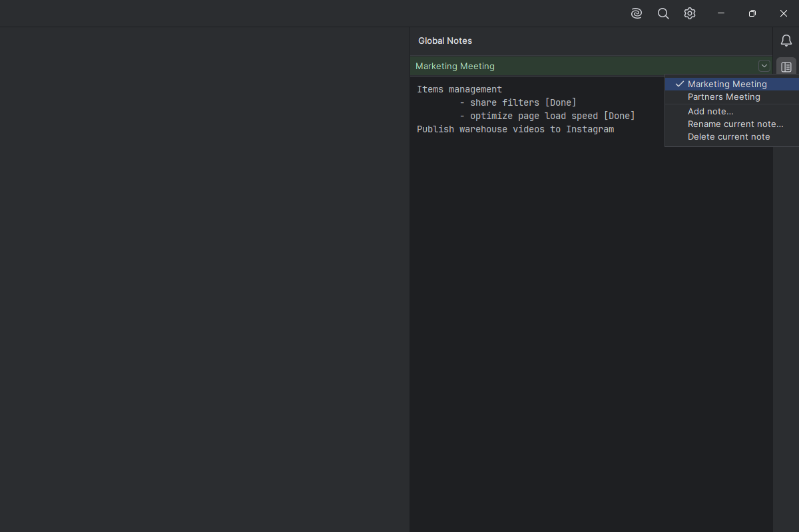
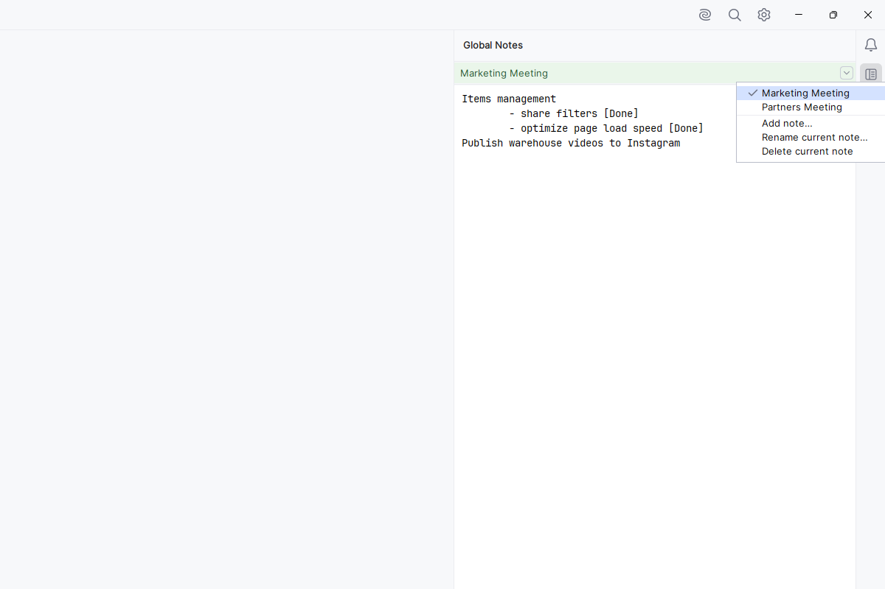

# Global Notes

Global Notes is an IntelliJ Platform plugin that provides a persistent, IDE-wide notes tool window. Keep reminders, working notes, project context, and other text available without leaving the IDE.

## Features

- Create and maintain multiple named notes.
- Select one active note to edit at a time.
- Add, rename, select, and delete notes from the menu in the note header.
- Automatically save note content and the active-note selection.
- Keep notes globally available across projects and IDE restarts.
- Use editor-theme-aware colors, font, and background for a comfortable writing area in both light and dark themes.

## Screenshots

### Dark theme



### Light theme



## Using the plugin

1. Open the **Global Notes** tool window from the right-hand tool-window bar.
2. Write in the active note; changes save automatically.
3. Click the chevron button on the right side of the note header to choose or manage notes.
4. Select **Add note...** to create a note, **Rename current note...** to rename it, or **Delete current note** to remove it.

At least one note is always kept, so there is always an active place to write.

## Data and privacy

Notes are stored locally in the IDE configuration using the IntelliJ Platform persistence API. Global Notes does not require an account and does not collect, transmit, or share note content or telemetry.

## Development

The project is written in Kotlin and uses the IntelliJ Platform Gradle Plugin. It currently targets IntelliJ IDEA `2025.3.5`.

### Build

Run the Gradle wrapper from the project root:

```powershell
.\gradlew.bat buildPlugin
```

The installable ZIP is generated in `build/distributions`.

### Run in a sandbox IDE

```powershell
.\gradlew.bat runIde
```

This starts a separate IntelliJ IDEA instance with Global Notes installed for testing.

## Project layout

```
src/main/kotlin/com/spavlov/globalnotes/
  NotesService.kt             Persisted note storage and note-management logic
  NotesToolWindowFactory.kt   Global Notes tool-window interface
src/main/resources/META-INF/
  plugin.xml                  Plugin metadata and tool-window registration
  pluginIcon.svg             Plugin Manager logo for light themes
  pluginIcon_dark.svg        Plugin Manager logo for dark themes
```

## License

Global Notes is available under the [Apache License 2.0](LICENSE).
